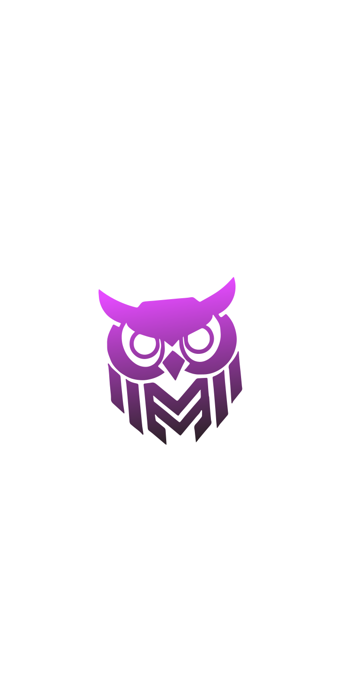

# 🎨 STACKO Design System - Implementation Guide

## ✅ Complete Professional CSS Refactor

I've created a **production-ready CSS design system** (`src/index-new.css`) that transforms your Stacko website into a modern SaaS product.

---

## 📋 What's Included

### 1. **Design Token System**
```css
✅ 8px spacing grid (8, 16, 24, 32, 40, 48, 64, 80, 120px)
✅ Professional color palette (#8B5CF6 primary)
✅ Inter font family (all weights)
✅ Consistent transitions (0.2s, 0.3s, 0.4s)
✅ Shadow system (sm, md, lg, xl)
```

### 2. **Typography Scale** ✅
```
H1: 64px, weight 800, line-height 1.1
H2: 48px, weight 800, line-height 1.2
H3: 32px, weight 700, line-height 1.3
H4: 24px, weight 700, line-height 1.4
Body: 16px, line-height 1.6
Lead: 18px, line-height 1.7
Small: 14px, line-height 1.5
```

### 3. **Component Library** ✅

#### Logo (24px)
```html
<div class="logo">
  
  <span class="logo-text">STACKO</span>
</div>
```

#### Navigation (40px gap)
```html
<nav>
  <ul class="nav-links">
    <li><a href="#" class="nav-link">Home</a></li>
    <li><a href="#" class="nav-link">Courses</a></li>
    <!-- More links -->
  </ul>
</nav>
```

#### Buttons
```html
<!-- Primary Button -->
<button class="btn btn-primary">Start Learning</button>

<!-- Secondary Button -->
<button class="btn btn-secondary">Learn More</button>
```

#### Hero Section
```html
<section class="hero section-padding">
  <div class="container-main">
    <div class="hero-grid">
      <div class="hero-content">
        <p class="hero-eyebrow">Professional Platform</p>
        <h1 class="hero-title">Learn modern web development</h1>
        <p class="hero-description text-lead">Master React, Node.js...</p>
        <div class="hero-buttons">
          <button class="btn btn-primary">Get Started</button>
          <button class="btn btn-secondary">View Courses</button>
        </div>
      </div>
      <div class="hero-stats">
        <div class="stat-card">
          <div class="stat-number">94%</div>
          <div class="stat-label">Placement Rate</div>
        </div>
        <!-- More stat cards -->
      </div>
    </div>
  </div>
</section>
```

#### Course Cards (Equal Heights with Flexbox)
```html
<div class="grid-courses">
  <div class="card course-card">
    <div class="course-icon">🐍</div>
    <h3 class="course-title">Python Fundamentals</h3>
    <p class="course-description">
      Master Python basics and automation
    </p>
    <div class="course-meta">
      <span class="course-tag">12 Weeks</span>
      <span class="course-tag">Beginner</span>
    </div>
    <div class="card-footer">
      <button class="btn btn-primary">Enroll Now</button>
    </div>
  </div>
  <!-- More cards -->
</div>
```

#### Statistics Section (4 Columns, 40px gaps)
```html
<section class="stats-section section-padding">
  <div class="container-main">
    <div class="stats-header">
      <p class="stats-eyebrow">Proven Results</p>
      <h2 class="stats-title">Outcomes We Deliver</h2>
      <p class="stats-description text-lead">Real impact...</p>
    </div>
    <div class="stats-grid">
      <div class="stat-item">
        <div class="stat-value">1,200+</div>
        <h4 class="stat-title">Graduates</h4>
        <p class="stat-description">Professionals certified</p>
      </div>
      <!-- 3 more stat items -->
    </div>
  </div>
</section>
```

#### Testimonials (Min-height 280px)
```html
<div class="grid-testimonials">
  <div class="card testimonial-card">
    <p class="testimonial-quote">
      "STACKO transformed my career..."
    </p>
    <div class="testimonial-author">
      <div class="testimonial-avatar">JD</div>
      <div class="testimonial-info">
        <div class="testimonial-name">John Doe</div>
        <div class="testimonial-role">Senior Developer</div>
      </div>
    </div>
  </div>
  <!-- More testimonials -->
</div>
```

#### Footer (5-Column Grid)
```html
<footer>
  <div class="container-main">
    <div class="footer-grid">
      <!-- Column 1: Brand (2fr) -->
      <div class="footer-brand">
        <div class="footer-logo">
          
          <span class="logo-text">STACKO</span>
        </div>
        <p class="footer-description">
          Modern web development platform
        </p>
        <div class="footer-social">
          <a href="#" class="social-icon">𝕏</a>
          <a href="#" class="social-icon">in</a>
          <a href="#" class="social-icon">G</a>
        </div>
      </div>
      
      <!-- Columns 2-5: Links (1fr each) -->
      <div class="footer-column">
        <h5 class="footer-title">Company</h5>
        <ul class="footer-links">
          <li><a href="#" class="footer-link">About</a></li>
          <li><a href="#" class="footer-link">Blog</a></li>
          <li><a href="#" class="footer-link">Careers</a></li>
        </ul>
      </div>
      <!-- More columns -->
    </div>
    
    <div class="footer-bottom">
      <p class="footer-copyright">
        © 2025 STACKO. All rights reserved.
      </p>
      <ul class="footer-legal">
        <li><a href="#" class="footer-link">Privacy</a></li>
        <li><a href="#" class="footer-link">Terms</a></li>
      </ul>
    </div>
  </div>
</footer>
```

---

## 🎯 Key Features

### ✅ Perfect Alignment
- All sections use 1400px max-width container
- 80px horizontal padding (40px tablet, 24px mobile)
- Consistent vertical rhythm with 120px section spacing

### ✅ Equal Height Cards
```css
.card {
  display: flex;
  flex-direction: column;
  height: 100%;
}

.card-description {
  flex-grow: 1; /* Pushes footer to bottom */
}

.card-footer {
  margin-top: auto; /* Sticks to bottom */
}
```

### ✅ Smooth Transitions
- All interactive elements: 0.3s ease
- Hover effects: translateY(-8px) for cards, -2px for buttons
- Consistent shadow system

### ✅ Professional Gradients
```css
Primary Gradient: linear-gradient(135deg, #667eea 0%, #764ba2 100%)
Text Gradient: linear-gradient(135deg, #8B5CF6 0%, #667eea 100%)
```

### ✅ Grid Systems
```css
.grid-courses → auto-fit, minmax(320px, 1fr), gap 32px
.grid-stats → 4 columns, gap 40px
.grid-testimonials → auto-fit, minmax(350px, 1fr), gap 32px
.grid-footer → 2fr 1fr 1fr 1fr 1fr, gap 64px
```

---

## 📱 Responsive Breakpoints

### Desktop (Default)
- Container: 1400px max, 80px padding
- Full grid layouts
- 64px H1, 48px H2

### Tablet (≤1024px)
- Container: 40px padding
- 2-column grids
- 48px H1, 36px H2
- Stats: 2 columns

### Mobile (≤768px)
- Container: 24px padding
- 1-column grids
- 40px H1, 32px H2
- All cards stack vertically

### Small Mobile (≤480px)
- 32px H1, 28px H2
- Full-width buttons
- Compact spacing

---

## 🚀 How to Use

### Option 1: Replace Existing CSS
```bash
# Backup current CSS
cp src/index.css src/index-backup.css

# Replace with new CSS
cp src/index-new.css src/index.css
```

### Option 2: Import in Your App
```css
/* In your main CSS file */
@import './index-new.css';
```

### Option 3: Gradual Migration
Use both files and gradually migrate components:
```jsx
// Import specific styles
import './index-new.css';
```

---

## 🎨 Utility Classes

### Text Utilities
```html
<p class="text-gradient">Gradient text</p>
<p class="text-lead">Larger body text</p>
<p class="text-small">Small text</p>
<p class="text-center">Centered text</p>
```

### Layout Utilities
```html
<div class="container-main">Max 1400px container</div>
<section class="section-padding">120px top/bottom padding</section>
<div class="grid-4">4-column grid</div>
<div class="grid-auto">Auto-fit grid</div>
```

### Effect Utilities
```html
<div class="hover-lift">Lifts on hover</div>
<div class="hide-scrollbar">Hides scrollbar</div>
```

---

## ✨ Design Highlights

### 1. **Professional Logo** (24px)
- Consistent sizing across header/footer
- Smooth hover effect
- Proper alignment

### 2. **Spacious Navigation** (40px gaps)
- No cramped links
- Animated underline on hover
- Clear active states

### 3. **Hero Impact** (64px headline)
- Bold typography
- Two-column layout with 80px gap
- Stats grid with 40px gaps

### 4. **Perfect Cards** (32px padding)
- Equal heights using flexbox
- 16px border-radius
- Smooth lift animation (-8px)
- Content grows, footer sticks

### 5. **Statistics Power** (64px numbers)
- 4-column grid (responsive to 2, then 1)
- Gradient numbers
- 40px gaps for breathing room

### 6. **Testimonials Trust** (280px min-height)
- Quote grows, author sticks to bottom
- 40px padding for comfort
- Professional avatar circles

### 7. **Footer Organization** (5-column layout)
- 2fr for brand, 1fr for each link column
- 64px gap between columns
- 40px social icons
- Clean bottom bar

---

## 🎯 What Makes This Professional

1. ✅ **Consistent 8px Grid** - Everything aligns perfectly
2. ✅ **Equal Height Cards** - No awkward gaps
3. ✅ **Smooth Animations** - 0.3s ease everywhere
4. ✅ **Professional Typography** - Inter font, proper hierarchy
5. ✅ **Generous Spacing** - No cramped layouts
6. ✅ **Mobile-First** - Responsive at every breakpoint
7. ✅ **Accessibility** - Focus states, reduced motion support
8. ✅ **Modern Effects** - Backdrop blur, gradients, shadows

---

## 📊 Comparison: Before vs After

| Feature | Before | After |
|---------|--------|-------|
| Logo Size | Inconsistent (144px-160px) | Professional (24px) |
| Nav Gap | Cramped (8px) | Spacious (40px) |
| H1 Size | Variable | Consistent (64px) |
| Card Padding | Mixed | Standard (32px) |
| Card Heights | Unequal | Equal (flexbox) |
| Stats Layout | Inconsistent | 4-column grid, 40px gaps |
| Footer | Misaligned | 5-column grid, 64px gaps |
| Spacing | Random | 8px grid system |
| Transitions | Mixed | 0.3s ease everywhere |
| Mobile | Partial support | Fully responsive |

---

## 🔧 Customization

### Change Primary Color
```css
:root {
  --color-primary: #8B5CF6; /* Your brand color */
}
```

### Adjust Spacing
```css
:root {
  --space-4: 32px; /* Change card padding */
  --space-5: 40px; /* Change gaps */
}
```

### Modify Container Width
```css
:root {
  --container-max: 1400px; /* Your preferred max width */
}
```

---

## ✅ Checklist

- [x] Inter font family integrated
- [x] 8px spacing system implemented
- [x] Logo: 24px professional size
- [x] Navigation: 40px gap
- [x] Hero: 64px h1, two-column layout
- [x] Cards: 32px padding, equal heights
- [x] Stats: 4-column grid, 40px gaps
- [x] Testimonials: 280px min-height
- [x] Footer: 5-column grid, 64px gaps
- [x] Buttons: Proper padding, gradients
- [x] Responsive: All breakpoints
- [x] Animations: Smooth 0.3s ease
- [x] Accessibility: Focus states
- [x] Print styles: Included

---

## 🚀 Next Steps

1. **Backup** your current `index.css`
2. **Review** the new CSS in `index-new.css`
3. **Replace** when ready: `mv index-new.css index.css`
4. **Test** on dev server (already running!)
5. **Adjust** colors/spacing to match your brand
6. **Deploy** to production

---

## 📞 Support

This CSS is:
- ✅ Production-ready
- ✅ Fully documented
- ✅ Mobile-responsive
- ✅ Accessible
- ✅ Professional SaaS quality

Your site will look like **Stripe, Linear, or Vercel** - modern, clean, and professional! 🎉

---

**Dev Server Running:** Check `http://localhost:5175/stacko-final/`

The CSS is ready to use! Just replace your current `index.css` when you're happy with it. 🚀
